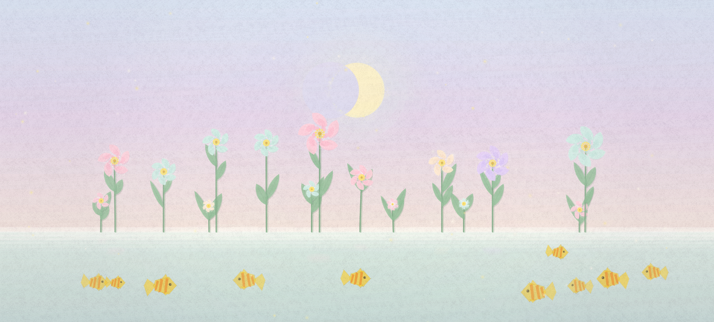

# 🌸 Lily Oasis

A pastel scene built with [p5.js](https://p5js.org/). Soft-pastel lilies sway in an organic wind, golden fish drift underwater, and pollens twinkle in a lavender sky. No frameworks, no build step.



---

## 🧩 Elements

- **Generative lilies**: Each flower blooms on load, with randomised petal colour, stem height, and depth layering
- **Moon cycle**: A crescent moon slowly phases from new to full over time, casting soft light across the scene
- **Organic wind simulation**: Multi-layered sine waves drive natural, non-repeating sway across stems, leaves, and petals
- **Soft pastel chalk texture** - A static paper-grain canvas overlays the scene, mimicking the powdery surface of soft pastels
- **Golden fish** - Tropical-style fish swim underwater, clipped 20% below the waterline, each with unique size and speed
- **Twinkling pollens** - Little pollens fly under wind independently across the gradient sky
- **Water ripples** - Small, circular ripples across the water surface. You may click anywhere to stir the wind too. 

---

## 🗂️ File Structure

```
lily-garden/
├── index.html           # Entry point - loads scripts in dependency order
├── css/
│   └── styles.css       # Layout, typography, UI overlay
└── js/
    ├── colorSettings.js # All colour palettes and colour utilities
    ├── easing.js        # Math helpers: easeOut, organicSway, mapClamp
    ├── helpers.js       # p5 wrappers: setFill, setStroke, drawGlow
    ├── texture.js       # Pastel paper grain, chalk edges, leaf stipple
    ├── objects.js       # Classes: Lily, StemLeaf, Fish, PollenParticle, Ripple
    ├── drawer.js        # Scene layers: sky, ground, mist, reflections, vignette
    └── sketch.js        # p5 setup() and draw() - thin orchestrator
```

> **Load order matters.** Each file only depends on what's above it:
> `colorSettings → easing → helpers → texture → objects → drawer → sketch`

---

## 🎮 Interaction

| Action | Effect |
|--------|--------|
| **Move cursor** | Shifts wind direction and intensity |
| **Click** | Triggers a gust of wind + spawns water ripples |
| **Resize window** | Scene rebuilds with new proportions |

---

## 🛠️ Built With

- [p5.js v1.11.11](https://cdn.jsdelivr.net/npm/p5@1.11.11/lib/p5.js) - creative coding library
- [Cormorant Garamond](https://fonts.google.com/specimen/Cormorant+Garamond) - Google Fonts
- Vanilla JavaScript

---

## 📌 Notes

- The paper grain texture is generated once at startup via fractional Brownian motion noise and cached as an off-screen canvas - so it's fast and never repeats exactly
- Fish are drawn using `drawingContext.clip()` to stay strictly below the waterline
- All randomness is seeded fresh on each page load - every run is unique

---

*Made with p5.js*
